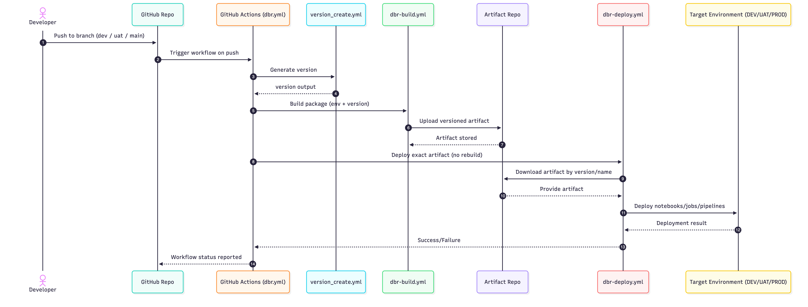
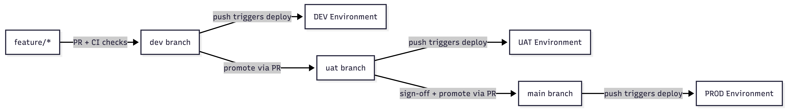
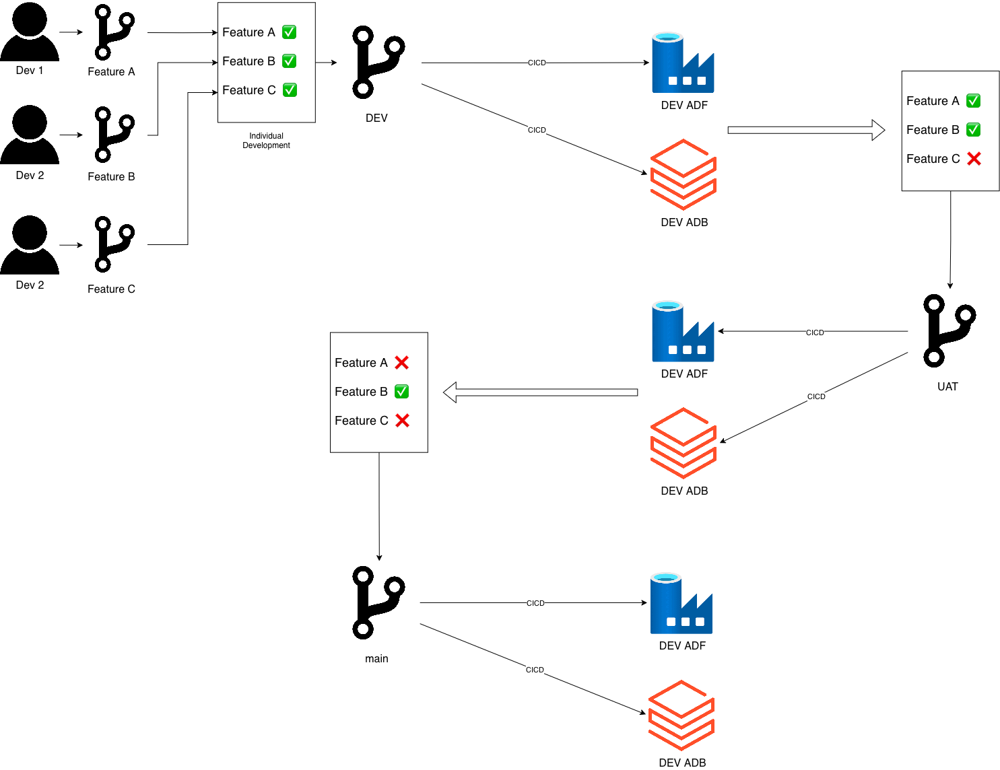

# Enterprise CI/CD Architecture  
## Multi-Environment Promotion Model (DEV → UAT → PROD)

---

## Overview

This repository documents a branch-driven CI/CD architecture designed to promote immutable artifacts across multiple environments:

**DEV → UAT → PROD**

The model enforces:

- Build once
- Promote the same artifact
- Prevent environment drift
- Maintain controlled release governance

---

## DIA-Datalake DevOps Release Model

**Strategy:**  
Release to UAT and PROD using the same built artifact.

**Advantages**
- No rebuild between environments
- Reduced deployment complexity
- Consistent binary across all stages

**Consideration**
- Code may exist in `main` that is not yet production-triggered without formal promotion controls

---

## System Architecture

  

---

# Promotion Lifecycle

The pipeline follows a **branch-based promotion model** using three long-lived branches:

- `dev`
- `uat`
- `main`

Each branch maps directly to an environment and triggers deployment on push.

---

## 1. Feature Development

- Developers create `feature/*` branches.
- Pull Requests trigger CI validation (linting, testing, security scanning).
- Approved changes merge into environment branches.

---

## 2. Continuous DEV Deployment

- Push to `dev` → automatic deployment to DEV.
- DEV serves as the integration playground.
- All merged work becomes immediately testable.

---

## 3. UAT Promotion

- Selected features are promoted via PR into `uat`.
- Push to `uat` triggers deployment to UAT.
- Business validation and sign-off occur here.

---

## 4. Production Release

- Approved commits are promoted into `main`.
- Push to `main` deploys the exact previously built artifact to PROD.
- No rebuild occurs.

This ensures immutability and traceability across environments.

---

# Pipeline Execution Flow

The following sequence diagram illustrates how a push event propagates through versioning, build, artifact storage, and deployment.

  

---

# Developer Interaction Flow

<table>
<tr>
<td width="55%" valign="top">

### Release Behavior

- `feature/*` → PR → environment branch
- Push to `dev` → Deploy DEV
- Push to `uat` → Deploy UAT
- Push to `main` → Deploy PROD
- UAT sign-off gates production

This guarantees artifact consistency and controlled promotion.

</td>

<td width="45%" align="center">

</td>
</tr>
</table>

---

# Promotion Funnel Visualization

This flow diagram represents branch-based promotion across environments.

  

---

# Data Engineer Promotion Funnel

<table>
<tr>
<td width="55%" valign="top">

### Environment Flow

DEV  
→ All merged work

UAT  
→ Validated subset

PROD  
→ Approved subset

Features remain in `dev` until promoted.  
Promotion is controlled by branch ownership.

</td>

<td width="45%" align="center">

</td>
</tr>
</table>

---

# GitHub Actions Workflow Architecture

The CI/CD process is implemented through reusable GitHub Actions workflows under:

`.github/workflows/`

Each workflow has a single responsibility.

---

## Workflow Responsibilities

| Workflow | Responsibility |
|-----------|---------------|
| `dbr.yml` | Orchestrator triggered on push to `dev`, `uat`, `main` |
| `version_create.yml` | Generates a semantic version |
| `dbr-build.yml` | Packages notebooks/jobs into a versioned artifact |
| `dbr-deploy.yml` | Deploys a previously built artifact to target environment |
| `docker-build.yml` | Builds the Databricks CLI Docker image |

---

# Orchestration Flow

1. Push to environment branch  
2. `dbr.yml` triggers  
3. `version_create.yml` generates version  
4. `dbr-build.yml` builds artifact  
5. `dbr-deploy.yml` deploys artifact  
6. No rebuild between environments  

This enforces:

- Artifact immutability  
- Environment isolation  
- Controlled promotion  

---

# Example Implementation Repositories

This repository includes two reference implementations:

- `ADF-CICD-dev`
- `databrickscicd-dev_collaboration`

These are sanitized example projects demonstrating how the architecture applies to real workloads.

---

## ADF-CICD-dev (Azure Data Factory)

Demonstrates CI/CD for Azure Data Factory.

Includes:

- Factory definitions (`factory/`, `pipeline/`, `dataset/`)
- ARM template export utilities
- GitHub workflow for validation + deployment
- Parameterization files

Illustrates exporting, packaging, and deploying ADF resources.

---

## databrickscicd-dev_collaboration (Databricks Bundle)

Demonstrates CI/CD using Databricks bundles.

Includes:

- `databricks.yml` bundle definition
- Environment configs (`dev.yml`, `uat.yml`, `prod.yml`)
- Example notebooks
- Promotion workflows
- Security scanning via composite GitHub Action

Shows multi-environment Databricks promotion using build-once methodology.

---

# Design Principles Enforced

- Build once, promote everywhere  
- Branch-based environment control  
- Artifact immutability  
- No environment drift  
- CI validation before promotion  
- Clear separation of build vs deploy responsibilities  

---

This repository represents a structured, enterprise-grade CI/CD promotion model suitable for data platform workloads including Azure Data Factory and Databricks.
