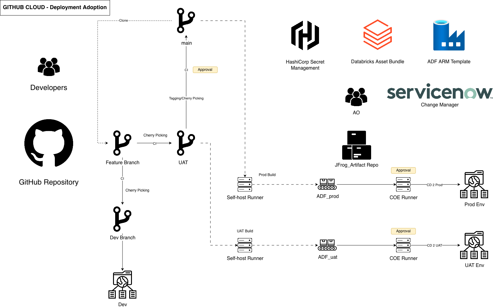
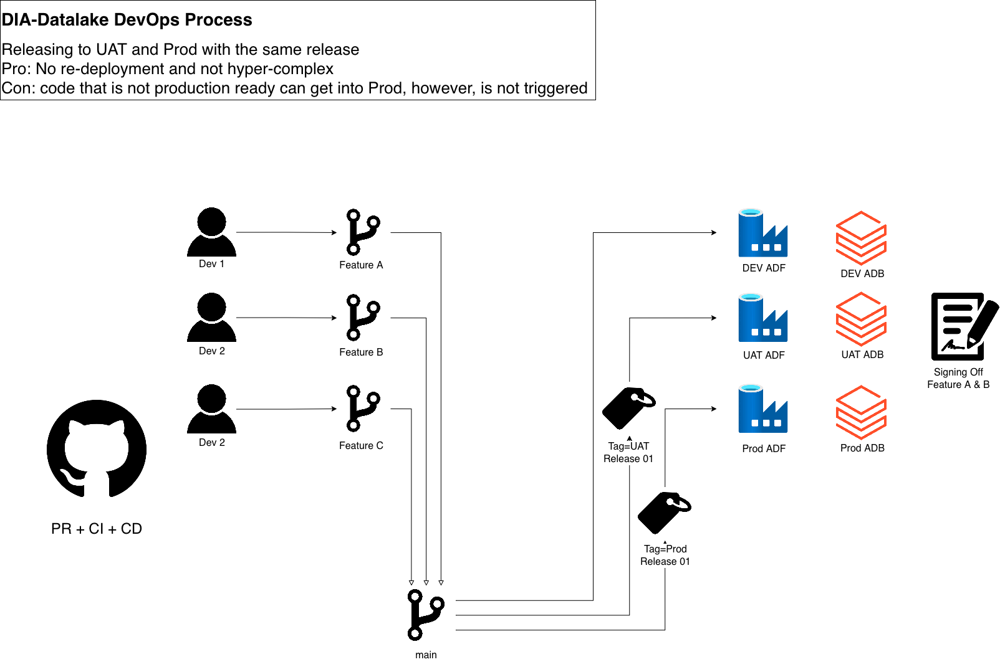

# Enterprise CI/CD Architecture  
### Multi-Environment Promotion Model (DEV → UAT → PROD)

---

## DIA-Datalake DevOps Process  
Releasing to UAT and PROD with the same release  

**Pro:** No re-deployment and low operational complexity  
**Con:** Non-production-ready code can exist in `main`, but is not triggered without release tags  

## System Architecture

  

## Promotion Lifecycle

This pipeline implements a **single-branch promotion model** centered around `main`.

### 1. Feature Development
- Developers create `feature/*` branches  
- Pull Requests trigger CI validation (PR + CI + CD)  
- Approved changes merge into `main`  

### 2. Continuous DEV Deployment
- Every merge into `main` automatically deploys to **DEV**  
- DEV acts as the continuous integration environment  

### 3. Controlled UAT Release
- A Git tag (e.g., `Tag-UAT-Release-01`) is created from `main`  
- The tagged commit is deployed to **UAT**  
- Business users sign off on selected features  

### 4. Controlled PROD Release
- A production tag (e.g., `Tag-Prod-Release-01`) is created from `main`  
- The same tagged commit is deployed to **PROD**  
- No rebuild is required; artifacts are promoted  

---

## Developer Interaction Flow

<table>
<tr>
<td width="55%" valign="top">

### Release Model Overview

- Developers create `feature/*` branches  
- Pull Requests trigger CI validation  
- Approved changes merge into `main`  
- DEV auto-deploys from `main`  
- UAT releases are triggered via `Tag-UAT-*`  
- PROD releases are triggered via `Tag-Prod-*`  
- UAT requires business sign-off before PROD  

This model ensures a single source of truth (`main`) while maintaining controlled environment promotion via tagging.

</td>

<td width="45%" align="center">

</td>
</tr>
</table>

---

## Data Engineer Interaction Flow

<table>
<tr>
<td width="55%" valign="top">

### Release Progression Model

- Multiple features may coexist in `main` simultaneously  
- All merged features automatically deploy to **DEV**  
- A subset of completed features is selected for UAT  
- UAT represents a curated release candidate  
- Only approved features progress to PROD  
- Production releases are triggered via `Tag-Prod-*`  
- Features not selected remain in `main`, but are not activated  

This model reflects a **progressive funnel approach**:

DEV (all merged work)  
→ UAT (validated subset)  
→ PROD (approved subset)

Progression is controlled through tagging and release ownership, not branch isolation.

</td>

<td width="45%" align="center">

</td>
</tr>
</table>
